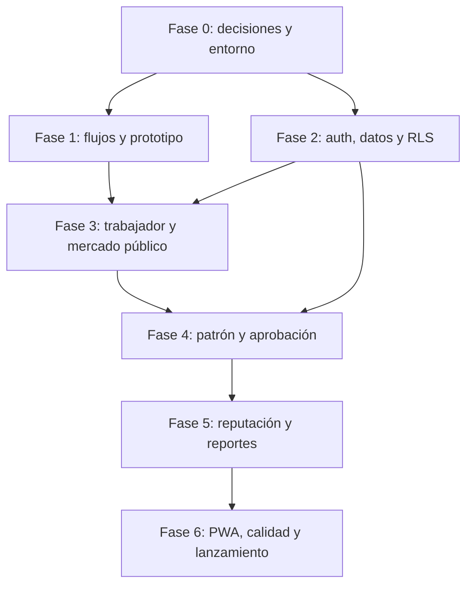

# Plan de implementación por fases — Rutacafetal MVP

> Versión inicial: 17 de julio de 2026  
> Producto: marketplace web móvil para conectar jornales y patrones de fincas cafetaleras en Jaén y provincias/distritos cercanos.

## 1. Objetivo del MVP

Lanzar una web pública, móvil-first y preparada como PWA, que permita:

- A un trabajador descubrir campañas de café, comparar condiciones y postular.
- A un patrón registrar su finca, crear una campaña y ordenar a sus postulantes.
- A un administrador aprobar campañas antes de hacerlas públicas, moderar reportes y gestionar bloqueos.
- A ambas partes contactar por WhatsApp **solo cuando el patrón acepte la postulación**.
- Construir una primera señal de confianza mediante calificaciones y reportes moderados.

El MVP valida si Rutacafetal logra generar campañas publicadas, postulaciones y contrataciones reales. No pretende todavía gestionar contratos, pagos, nóminas, geolocalización precisa ni mensajería interna.

## 2. Decisiones de alcance confirmadas

| Tema | Decisión para el MVP |
| --- | --- |
| Marca | Rutacafetal |
| Cobertura | Jaén y distritos/provincias cercanas |
| Cultivo publicado | Café: cosecha, mantenimiento y postcosecha |
| Plataforma | Web app responsive y PWA, optimizada para Android básico |
| Moderación | Manual por el administrador inicial |
| Visibilidad de campañas | Una campaña requiere aprobación antes de aparecer públicamente |
| Contacto | El teléfono no es público; el patrón accede al botón de WhatsApp tras aceptar una postulación |
| Confianza | Calificaciones y reportes desde el lanzamiento; revisión humana de contenido sensible |
| Datos del trabajador | Nombre, teléfono, distrito/localidad, cultivos, experiencia y disponibilidad; preferencias y descripción opcionales |
| Datos del patrón | Nombre/razón social, teléfono y zona; fincas reutilizables y campañas con pago, fechas y condiciones claras |

## 3. Supuestos y decisiones pendientes

Estas decisiones bloquean partes concretas del desarrollo; deben cerrarse en la Fase 0.

1. **Autenticación.** El teléfono es el dato de contacto principal, pero verificarlo por OTP exige un proveedor de SMS o WhatsApp y tiene coste. Se debe elegir una de estas rutas:
   - teléfono con OTP desde el primer lanzamiento, configurando proveedor y presupuesto;
   - acceso inicial por email y contraseña/enlace mágico, con teléfono obligatorio pero verificado manualmente por el administrador;
   - piloto cerrado con altas creadas/aprobadas manualmente antes de abrir el registro público.
2. **Ubicaciones iniciales.** Definir el listado controlado de provincias y distritos que aparecerá en filtros y formularios, en vez de aceptar texto libre en los campos de búsqueda.
3. **Políticas públicas.** Preparar Términos de uso, Política de privacidad y una guía de seguridad. Deben explicar que Rutacafetal intermedia el contacto, no garantiza pagos ni reemplaza acuerdos laborales.
4. **Canal de soporte.** Definir un número o correo oficial para ayuda y apelaciones a bloqueos/reportes.

## 4. Principios de implementación

- Diseñar y probar primero las rutas de trabajador; son el principal motor de liquidez del marketplace.
- Pedir solamente los datos que permitan un buen match. No solicitar DNI, dirección exacta ni documentos en el flujo público.
- Mantener los teléfonos fuera de consultas y páginas públicas. La acción de WhatsApp se habilita solo para el patrón dueño de la campaña y una postulación aceptada.
- Tratar acusaciones de no pago, maltrato o robo como contenido privado de moderación; no mostrarlas como comentarios públicos automáticos.
- Permitir calificar únicamente a participantes de una contratación asociada a una campaña cerrada, con una calificación por dirección y campaña.
- Priorizar texto claro, botones grandes, bajo peso de página y formularios de 3–4 pasos como máximo.
- Usar un modelo de datos extensible a más cultivos y regiones, sin exponerlos en la interfaz hasta validar café.

## 5. Fases, entregables y definición de terminado

### Fase 0 — Descubrimiento, riesgos y base del proyecto

**Objetivo:** convertir el brief en decisiones operables y preparar un entorno seguro de desarrollo.

**Trabajo:**

1. Definir la ruta de autenticación y documentar su coste, proveedor y experiencia de recuperación de acceso.
2. Definir el catálogo inicial de provincias/distritos y los valores controlados para cultivo, tipos de labor, pago, experiencia y disponibilidad.
3. Redactar el contenido mínimo de Términos, Privacidad, Seguridad y reglas de calificaciones/reportes.
4. Realizar entrevistas breves con al menos 2 patrones y 3 trabajadores para validar lenguaje, datos requeridos y condiciones que determinan una postulación.
5. Crear el repositorio, configurar Next.js con TypeScript, Tailwind CSS, formateo, linting, pruebas básicas y variables de entorno.
6. Crear proyectos separados de Supabase para desarrollo y producción; no usar la base de producción durante pruebas locales.
7. Configurar despliegues de vista previa y producción, y documentar el proceso de publicación.

**Entregables:** decisiones de producto cerradas, guion de entrevistas y hallazgos, repositorio inicial, entornos y guía de configuración.

**Definición de terminado:** el proyecto arranca localmente, tiene una vista previa desplegable, no expone secretos y la ruta de autenticación está elegida antes de crear formularios de registro.

### Fase 1 — Experiencia y sistema visual validable

**Objetivo:** acordar una interfaz simple antes de invertir en lógica compleja.

**Trabajo:**

1. Crear mapa de recorridos para trabajador, patrón y administrador.
2. Diseñar wireframes de: inicio/listado, filtros, detalle de campaña, registro/onboarding, perfil de trabajador, alta de finca, creación de campaña, postulaciones, moderación y reporte.
3. Definir un sistema visual mínimo: logo temporal o definitivo, paleta inspirada en café/campo, tipografía legible, espaciado, estados de alerta y componentes reutilizables.
4. Construir un prototipo navegable con contenido realista de Jaén para probar comprensión, no solo apariencia.
5. Validar los recorridos con las mismas personas entrevistadas y ajustar textos, orden de campos y acciones principales.

**Entregables:** flujos, wireframes/prototipo, guía visual mínima y copia de interfaz en español sencillo.

**Definición de terminado:** un trabajador puede encontrar y postular conceptualmente a una campaña en máximo cuatro pantallas; un patrón puede publicar una campaña y entender que espera aprobación; los participantes comprenden el significado de pago, alojamiento y el momento en que se comparte el contacto.

### Fase 2 — Fundaciones técnicas, datos y acceso

**Objetivo:** implementar la base segura sobre la que funcionarán todos los módulos.

**Trabajo:**

1. Configurar Supabase Auth según la decisión de Fase 0, sesiones, recuperación de acceso y rutas protegidas.
2. Crear perfiles vinculados a la identidad de autenticación con roles `worker`, `farmer` y `admin`.
3. Modelar y migrar las entidades principales: perfiles, ubicaciones, cultivos, fincas, campañas, postulaciones, asignaciones, calificaciones, reportes y eventos de moderación.
4. Añadir estados explícitos:
   - campaña: borrador, pendiente de revisión, publicada, cerrada, rechazada, cancelada;
   - postulación: pendiente, aceptada, rechazada, retirada;
   - reporte: abierto, en revisión, resuelto, descartado;
   - usuario: activo, verificado, suspendido.
5. Aplicar RLS y validación de servidor: cada rol puede leer y modificar únicamente los datos necesarios para su acción.
6. Crear índices para campañas publicadas por ubicación, fecha, tipo de trabajo, pago y alojamiento; añadir paginación desde el primer listado.
7. Sembrar datos ficticios para desarrollo y pruebas, claramente separados de usuarios reales.

**Entregables:** migraciones versionadas, políticas de acceso, esquema documentado, datos de prueba y pruebas de autorización.

**Definición de terminado:** una consulta pública nunca devuelve teléfonos, una persona no puede cambiar de rol ni leer postulaciones ajenas, y el administrador puede acceder a las colas de aprobación y moderación.

### Fase 3 — Mercado público y perfil del trabajador

**Objetivo:** habilitar el lado de demanda: descubrir oportunidades y postular sin fricción.

**Trabajo:**

1. Construir inicio público con campañas publicadas, tarjetas de lectura rápida y estados vacíos útiles.
2. Implementar filtros por provincia/distrito, fechas, tipo de labor, alojamiento y modalidad de pago; conservar los filtros en la URL para compartirlos.
3. Implementar detalle de campaña con pago, beneficios, fechas, referencia geográfica textual, normas de seguridad y reputación resumida del patrón.
4. Crear onboarding y edición de perfil del trabajador:
   - obligatorios: nombre, teléfono, distrito/localidad, cultivos trabajados, nivel de experiencia y disponibilidad;
   - opcionales: descripción corta, preferencia de pago y aceptación de alojamiento.
5. Implementar postulación con mensaje opcional, prevención de duplicados y confirmación visible.
6. Crear la vista privada de “Mis postulaciones” con estados y posibilidad de retiro mientras esté pendiente.
7. Añadir estados de carga, errores comprensibles y accesibilidad para uso desde celular.

**Entregables:** mercado público funcional, perfiles de trabajador y flujo completo de postulación.

**Definición de terminado:** un visitante puede filtrar y leer campañas sin crear cuenta; un trabajador registrado completa su perfil y postula; el teléfono del patrón sigue oculto en todos los casos.

### Fase 4 — Herramientas del patrón y moderación previa

**Objetivo:** permitir publicar ofertas confiables y gestionar candidatos.

**Trabajo:**

1. Implementar onboarding y perfil del patrón: nombre/razón social, teléfono y zona de operación.
2. Implementar CRUD de fincas reutilizables con nombre, distrito, referencia geográfica y cultivo principal; mantener ubicación exacta fuera de la vista pública.
3. Implementar creación, edición, cierre y cancelación de campañas con validaciones de fechas, cupos, pago y beneficios.
4. Enviar cada nueva campaña o edición sustancial a estado “pendiente de revisión”; no hacerla pública automáticamente.
5. Crear panel “Mis campañas” y detalle de postulantes con información de match: experiencia, cultivos, distrito y disponibilidad.
6. Implementar aceptar/rechazar postulaciones con control de cupos y creación de asignación al aceptar.
7. Habilitar el botón de WhatsApp con texto prellenado solo cuando el patrón aceptó la postulación. Registrar el evento sin almacenar el contenido de la conversación.
8. Crear consola administrativa para aprobar/rechazar campañas, verificar perfiles, suspender usuarios y dejar una nota interna de la decisión.

**Entregables:** flujos de finca, campaña, selección y aprobación administrativa.

**Definición de terminado:** una campaña no se ve públicamente sin aprobación; solo el dueño de la campaña puede ver candidatos y abrir WhatsApp con un trabajador aceptado; el administrador puede resolver una cola de revisión sin acceder a información innecesaria.

### Fase 5 — Reputación, reportes y cierre seguro de campañas

**Objetivo:** añadir confianza sin crear un espacio de acusaciones públicas no moderadas.

**Trabajo:**

1. Marcar asignaciones como completadas al cerrar una campaña, con revisión de que ambas partes estuvieron vinculadas a ella.
2. Permitir que trabajador y patrón se califiquen una sola vez por campaña completada: puntuación de 1 a 5 y comentario corto.
3. Mostrar promedios, total de campañas completadas y comentarios aprobados; ocultar contenido pendiente o rechazado.
4. Añadir reporte privado contra usuario o campaña, con categorías claras, descripción, evidencia opcional si se habilita almacenamiento y confirmación de recepción.
5. Crear cola de moderación: priorización, estado, notas internas, resolución, suspensión/bloqueo y registro de auditoría.
6. Aplicar límites de longitud, rate limits y validación para reducir spam, insultos y abuso del formulario.
7. Incluir rutas de ayuda, seguridad y apelación visibles desde el reporte y los estados de suspensión.

**Entregables:** reputación basada en participación real, reportes privados y consola de moderación trazable.

**Definición de terminado:** nadie puede calificar sin una asignación completada; los reportes no se publican automáticamente; una suspensión impide iniciar acciones sensibles y queda registrada con motivo interno.

### Fase 6 — PWA, calidad, analítica y lanzamiento público

**Objetivo:** preparar una primera versión confiable para publicidad y aprendizaje real.

**Trabajo:**

1. Configurar manifest, iconos, instalación y una estrategia de caché conservadora para la interfaz; no cachear datos privados ni contactos.
2. Optimizar para conexiones lentas: imágenes comprimidas, carga diferida, presupuestos de peso, formularios resilientes y páginas públicas rápidas.
3. Añadir SEO básico para campañas públicas: metadatos, Open Graph, sitemap, robots y URLs compartibles.
4. Instrumentar métricas de producto respetuosas de la privacidad: registros por rol, campañas enviadas/aprobadas, postulaciones, aceptaciones, campañas cerradas, reportes y uso del botón de WhatsApp.
5. Implementar páginas legales, política de cookies si corresponde y canal de soporte.
6. Crear pruebas unitarias para validaciones y permisos, pruebas de integración de los flujos críticos y pruebas end-to-end de trabajador, patrón y administrador.
7. Realizar revisión de seguridad, accesibilidad móvil, contenido y rendimiento antes de producción.
8. Preparar datos iniciales verificados, guía operativa para moderación y material de lanzamiento/publicidad.

**Entregables:** PWA instalable, panel de métricas, suite de pruebas, guía de operación y producción pública.

**Definición de terminado:** los tres flujos críticos funcionan en móvil real, no se filtran teléfonos, las campañas aprobadas pueden encontrarse y compartirse, las métricas se registran y existe un procedimiento documentado para revisar campañas/reportes cada día.

## 6. Orden de dependencias

No se debe empezar la publicidad pública hasta completar Fase 6. Sí es recomendable probar desde Fase 3–4 con un grupo pequeño de trabajadores y patrones, usando campañas controladas.

## 7. Métricas de validación

Medir semanalmente, separando datos por provincia/distrito y rol:

| Métrica | Propósito |
| --- | --- |
| Trabajadores registrados con perfil completo | Medir oferta útil, no solo registros |
| Patrones registrados y campañas enviadas | Medir interés del lado que publica empleo |
| Porcentaje de campañas aprobadas | Detectar calidad de altas y carga de moderación |
| Postulaciones por campaña publicada | Medir liquidez inicial del marketplace |
| Tiempo hasta primera postulación | Medir capacidad de respuesta del mercado |
| Tasa de aceptación de postulaciones | Medir calidad del match |
| Campañas cerradas con trabajadores asignados | Señal principal de valor entregado |
| Uso del botón de WhatsApp tras aceptación | Señal de intención de coordinación |
| Reportes por cada 100 campañas | Detectar riesgos de confianza y seguridad |
| Satisfacción/calificación tras campañas | Medir confianza de ambos lados |

## 8. Riesgos y mitigaciones iniciales

| Riesgo | Mitigación en el MVP |
| --- | --- |
| Poca oferta o demanda inicial | Lanzamiento por zonas, datos iniciales verificados y pruebas con grupos pequeños antes de publicidad amplia |
| Estafas o publicaciones falsas | Aprobación manual, perfiles verificables, reportes privados, suspensiones y no publicar teléfonos |
| Exposición de datos personales | RLS, validaciones de servidor, contactos privados y revisión de consultas públicas |
| Reputación usada para difamar | Calificaciones ligadas a campañas completadas y moderación de comentarios/reportes |
| Coste o complejidad de OTP | Decisión explícita de Fase 0 y alternativa temporal documentada |
| Conectividad limitada | Interfaz liviana, PWA y mínimos recursos pesados |
| Sobrecarga de moderación para una sola persona | Cola priorizada, estados claros, plantillas de decisión y límites contra spam |

## 9. Fuera de alcance del MVP

- Contratos laborales, nóminas, pagos dentro de la plataforma o cobro de comisiones.
- Mensajería interna y lectura de conversaciones de WhatsApp.
- Verificación documental automatizada o integración con identidad estatal.
- Mapas con ubicación exacta de fincas, seguimiento GPS o transporte en tiempo real.
- Integración con cooperativas, AgroDigital, APIs de WhatsApp Business o notificaciones automatizadas.
- Soporte visible para cultivos distintos al café, aunque el modelo de datos quedará preparado.

## 10. Criterio de salida del MVP

Rutacafetal estará listo para aprender del mercado cuando haya campañas reales aprobadas, trabajadores que puedan postular desde un teléfono, patrones que acepten postulaciones y contacten a los trabajadores mediante el flujo protegido de WhatsApp, y un proceso diario viable para que el administrador modere campañas, reportes y reputación.

La siguiente iteración debe decidirse a partir de esas métricas y de entrevistas con usuarios activos, no solo por la lista de funcionalidades del roadmap original.
